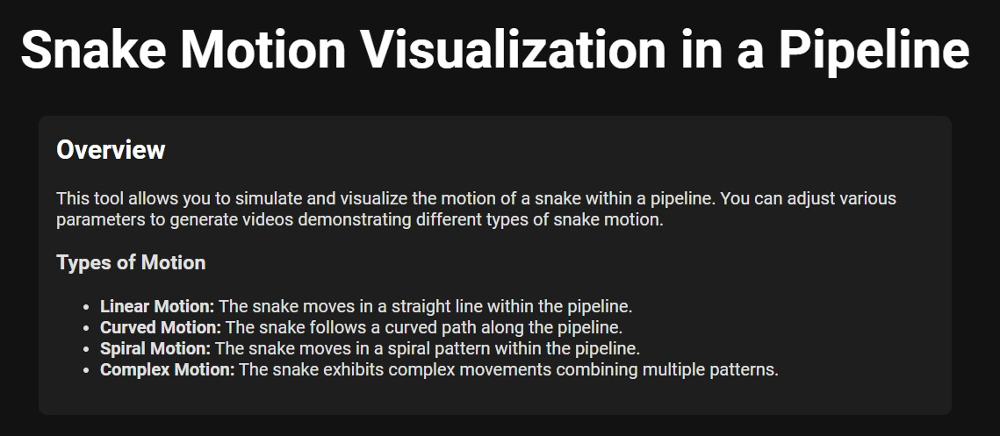
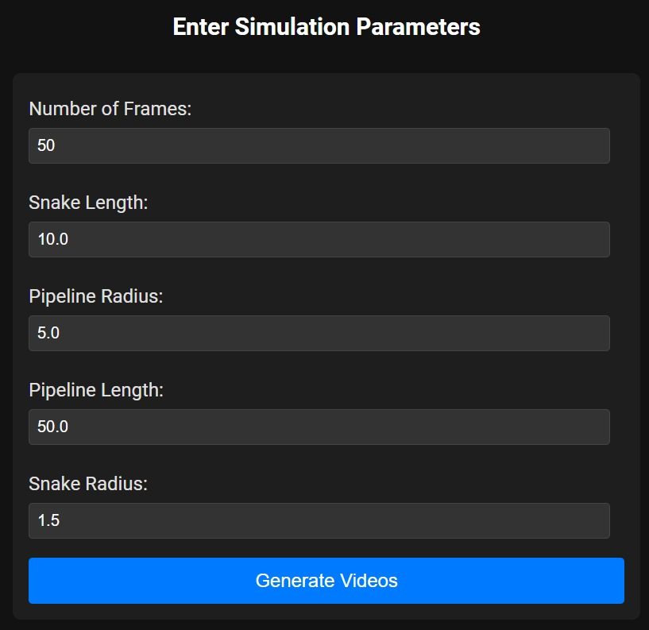
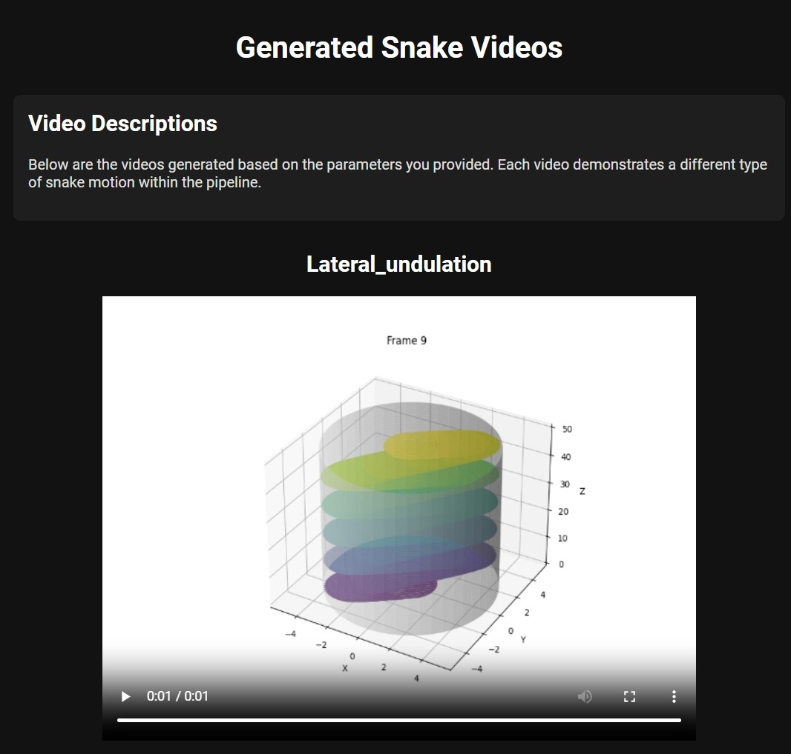
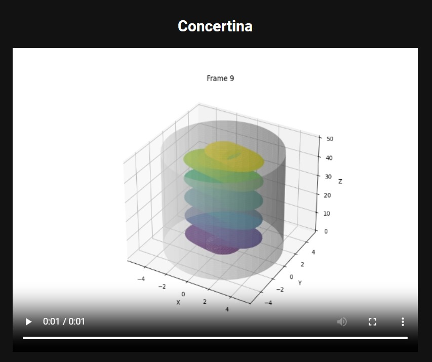
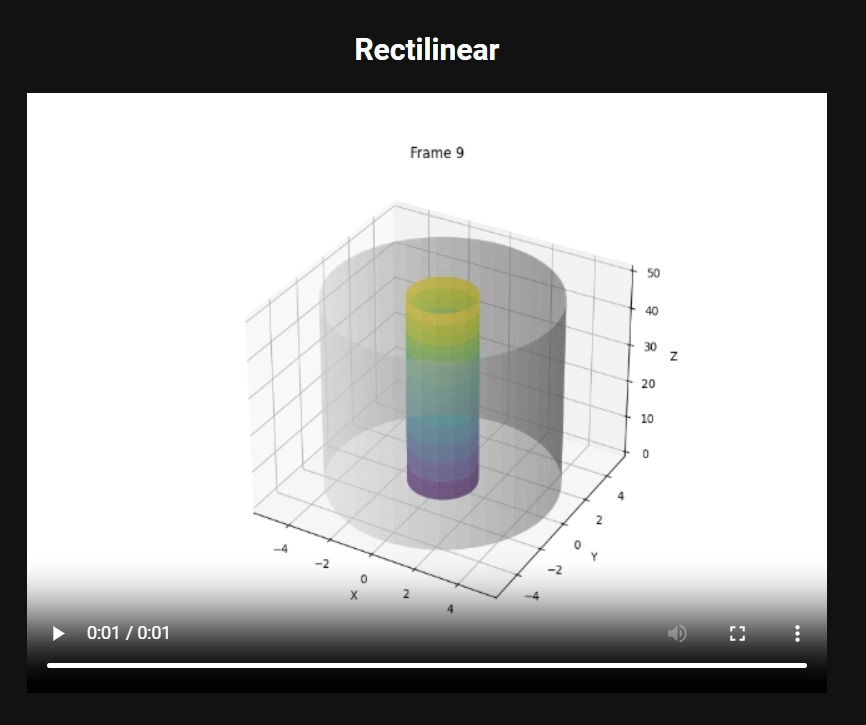
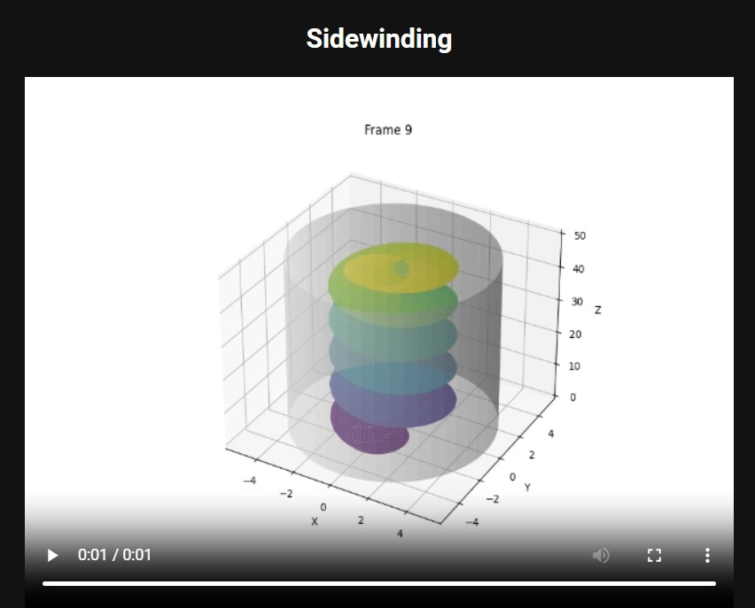

# Snake Motion Visualization in a Pipeline

This project visualizes different types of snake motion in a cylindrical pipeline and generates corresponding MP4 videos. The visualizations are created using `matplotlib` for 3D plotting and `OpenCV` for video processing.

## Features

- **Motion Types**:

  - Lateral Undulation
  - Concertina
  - Rectilinear
  - Sidewinding

- **Output**: MP4 videos showing the snake's movement in a cylindrical pipeline.

## Screenshots













## Requirements

- Python 3.x
- numpy
- matplotlib
- opencv-python
- pip install `numpy matplotlib opencv-python`

## Code Overview

1. **Parameters**: Set the number of frames, snake and pipeline dimensions, and snake radius.
2. **Cylinder Creation**: Generates the cylindrical wall of the pipeline.
3. **Motion Functions**: Define different types of snake motion within the pipeline.
4. **Frame Saving**: Saves each frame as an image and converts it into a video.
5. **Video Creation**: Compiles frames into MP4 videos.

## Code Snippets

### Define Parameters and Functions

```python
n_frames = 50
snake_length = 10
pipeline_radius = 5
pipeline_length = 50
snake_radius = 1.5

def create_cylindrical_wall():
    # Creates the cylindrical wall for the pipeline
    ...

def lateral_undulation(t):
    # Generates snake motion for lateral undulation
    ...

def concertina(t):
    # Generates snake motion for concertina
    ...

def rectilinear(t):
    # Generates snake motion for rectilinear
    ...

def sidewinding(t):
    # Generates snake motion for sidewinding
    ...
```

### Save Frames and Create Videos

```python
def save_frame_as_image(frame_num, X_cyl, Y_cyl, Z_cyl, X_snake, Y_snake, Z_snake, filename):
    # Saves a single frame as an image
    ...

def create_video(motion_type):
    # Creates a video based on the specified motion type
    ...
```

### Create Videos for All Motion Types

```python
# Create videos for different types of motion
create_video('lateral_undulation')
create_video('concertina')
create_video('rectilinear')
create_video('sidewinding')
```

## Running the Code

1. **Install Dependencies**: Ensure all required libraries are installed.
2. **Execute**: Run the script to generate videos for different types of snake motion.

   ```bash
   python script_name.py
   ```

3. **Output**: The generated videos will be saved as `snake_<motion_type>.mp4` in the script directory.
